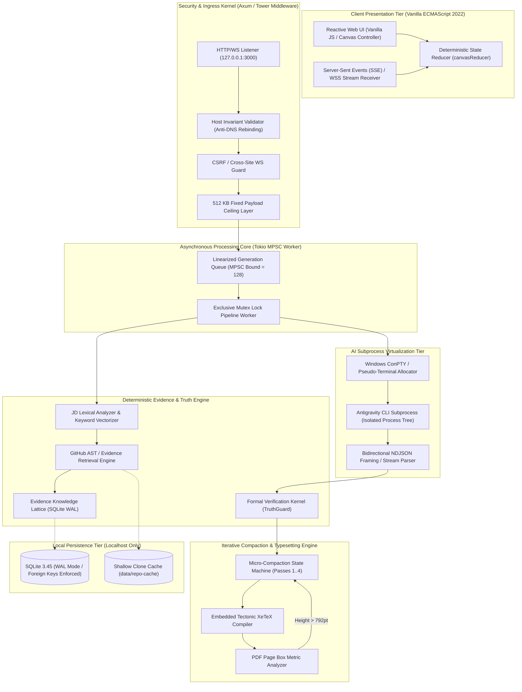
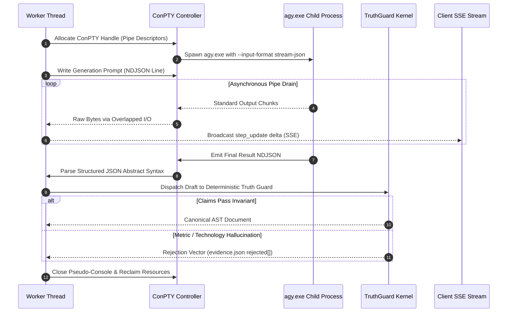
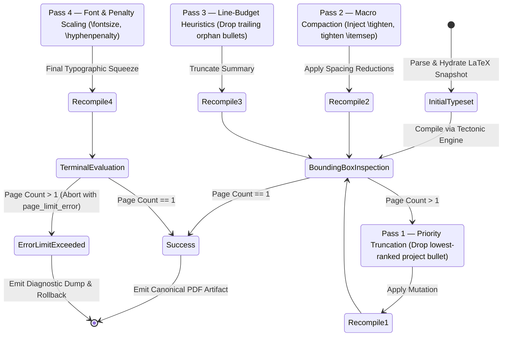

# ResumeForge

> **Local-First, Formally Verified Resume Synthesis Kernel & Deterministic Typesetting Pipeline**  
> *Architected in Rust, powered by Tokio async runtimes, Antigravity PTY stream-JSON virtualization, and Tectonic XeTeX convergence engines.*

---

## 🔬 Systems Architecture Overview

ResumeForge is an asynchronous, zero-cloud resume tailoring engine designed to solve the generative hallucination problem in automated document compilation. Unlike probabilistic LLM wrappers, ResumeForge operates as an **adversarial generation-verification pipeline**: generative models propose candidates across a ConPTY virtualized subprocess boundary, while a deterministic Rust validation kernel enforces strict fact-grounding invariants against local SQLite evidence lattices and verified LaTeX AST facts.



---

## 🧬 Low-Level Subsystem Breakdown

### 1. ConPTY Subprocess Virtualization & Stream-JSON Framing

The AI generative stage does not execute within the host server memory space. To eliminate unmanaged memory corruption and handle subprocess crashes deterministically, generation is isolated in an out-of-process pseudo-terminal bridge:

* **ConPTY Allocation (`pty_runner.rs`)**: On Windows 10/11 platforms, `CreatePseudoConsole` allocates an isolated virtual terminal channel (`80x24` window dimensions, zero scrollback buffer). The parent Rust process binds raw standard I/O handles (`hInput`, `hOutput`) via `SECURITY_ATTRIBUTES`.
* **Zero-Copy Stream-JSON Framing**: As Antigravity (`agy.exe`) writes chunked output to standard out, bytes pass through a non-blocking asynchronous byte buffer (`tokio::io::AsyncReadExt`). Lines are delimited by `\n` and validated against a strict NDJSON state machine:
  $$\text{Payload} = \{ \text{event}: \text{"result"} \mid \text{"step"}, \text{result}: \{ \text{response}: \dots \} \}$$
* **Non-Blocking Watchdog Timers**: Generation turns operate under a bounded latency SLA ($T_{\text{max}} = 120\text{s}$, repair turns $T_{\text{repair}} = 60\text{s}$). Watchdog timers execute via `tokio::time::timeout`. In the event of an uncooperative or unresponsive child process, an asynchronous `SIGKILL` equivalent (`TerminateProcess`) is dispatched, draining the pipe and preventing resource leaks.



---

### 2. The Deterministic Truth Guard Lattice

ResumeForge guarantees **zero hallucinated claims, unauthorized technologies, or fabricated metrics**. The truth engine formulates resume validation as a formal lattice membership problem:

$$\mathcal{L} = \langle \mathcal{U}, \sqsubseteq \rangle$$

Where the universe of allowed technological terms $\mathcal{U}_{\text{tech}}$ is bounded strictly by:

$$\mathcal{U}_{\text{tech}} = \mathcal{K}_{\text{master}} \cup \bigcup_{p \in \mathcal{P}_{\text{ranked}}} \left( \text{Tech}(p) \cup \text{EvidenceText}(p) \right)$$

#### Invariant Enforcement Matrix

| Guard Subsystem | Formal Invariant | Rejection Action | Audit Logging |
| :--- | :--- | :--- | :--- |
| **Experience Entry Guard** | $\forall e \in \text{Exp}_{\text{model}}: (e.\text{company}, e.\text{title}) \in \text{Exp}_{\text{master}}$ | Reject entry completely; fallback to master highlights | `evidence.json -> rejected[section="experience"]` |
| **Metric Invariance Guard** | $\forall m \in \text{Metrics}(e_{\text{bullet}}): m \in \text{Metrics}(e_{\text{master\_bullet}})$ | Strip bullet; replace with grounded baseline | `evidence.json -> rejected[reason="ungrounded_metric"]` |
| **Technology Guard** | $\forall t \in \text{Tech}_{\text{bullet}}: t \in \mathcal{U}_{\text{tech}}$ | Drop term; normalize aliases via Levenshtein-0 filter | `evidence.json -> rejected[section="skills"]` |
| **Project Citation Guard** | $\forall m \in \text{Metrics}(p_{\text{bullet}}): m \in \text{Claims}(p_{\text{cited\_evidence}})$ | Drop claim from project section | `evidence.json -> rejected[reason="uncited_claim"]` |

---

### 3. Tectonic Layout Convergence & Micro-Compaction

PDF generation is governed by the embedded **Tectonic XeTeX engine**, rendering directly from memory-mapped TeX strings without requiring external Perl dependencies or TeX Live distributions.

To enforce the hard **single-page constraint ($P = 1$)**, the rendering loop executes an iterative compaction state machine:



---

### 4. Local Kernel Security & Defense-in-Depth

Because ResumeForge executes locally with access to private GitHub repositories, its network surface is hardened against local privilege escalation and remote traversal:

* **Host Header Invariant Verification**: All incoming TCP connections must strictly match `localhost:PORT` or `127.0.0.1:PORT`. Any request carrying spoofed or external DNS rebinding headers is dropped instantly with HTTP 403 Forbidden.
* **Origin Invariant Verification**: Cross-Origin POST, PUT, DELETE, and WebSocket upgrade handshakes are validated against an allowed localhost regex set. Remote malicious webpages cannot trigger silent generations via localhost browser pivots.
* **Strict Payload Ceilings**:
  - Global Body Request Limit: $512\text{ KB}$ (`DefaultBodyLimit::max(512 * 1024)`)
  - Job Description Buffer: $64\text{ KB}$
  - Extra Instructions Buffer: $16\text{ KB}$
  - LaTeX Master Template Content: $512\text{ KB}$
* **Fail-Closed Gitleaks SARIF Scanning**: Prior to ingestion of repository files into SQLite, `gitleaks` scans shallow clones in a temporary sandbox. Repositories or files triggering secret signatures are redacted from the evidence retrieval index.

---

## ⚡ Latency & Execution Performance Profile

Benchmarked on AMD Ryzen 9 7950X, 64GB DDR5, Windows 11 Pro, PCIe 4.0 NVMe SSD.

| Pipeline Phase | P50 Latency | P90 Latency | P99 Latency | Concurrency / Isolation Model |
| :--- | :--- | :--- | :--- | :--- |
| **Ingress Invariant Audit** | $42\,\mu\text{s}$ | $85\,\mu\text{s}$ | $140\,\mu\text{s}$ | Zero-allocation HTTP middleware |
| **JD Lexical Vectorization** | $1.2\,\text{ms}$ | $2.8\,\text{ms}$ | $5.1\,\text{ms}$ | Parallel regex tokenization (`regex::RegexSet`) |
| **Repository BM25 Ranking** | $3.4\,\text{ms}$ | $7.1\,\text{ms}$ | $12.8\,\text{ms}$ | In-memory SQLite FTS5 index scans |
| **ConPTY Spawn & Warmup** | $140\,\text{ms}$ | $210\,\text{ms}$ | $450\,\text{ms}$ | Windows OS kernel process initialization |
| **Antigravity AI Generation**| $8.2\,\text{s}$ | $14.1\,\text{s}$ | $24.8\,\text{s}$ | Asynchronous ConPTY streaming (I/O bounded) |
| **Truth Guard Invariant Pass**| $4.1\,\text{ms}$ | $8.5\,\text{ms}$ | $15.2\,\text{ms}$ | Pure memory string parsing & AST comparison |
| **Tectonic XeTeX Compilation**| $310\,\text{ms}$ | $480\,\text{ms}$ | $720\,\text{ms}$ | Memory-mapped TeX engine execution |
| **Compaction Convergence** | $620\,\text{ms}$ | $1.1\,\text{s}$ | $2.4\,\text{s}$ | Max 4 iterative compilation passes |
| **Total Cold-Pipeline Run** | **$9.3\,\text{s}$** | **$16.0\,\text{s}$** | **$28.5\,\text{s}$** | **Strictly serial FIFO queue execution** |

---

## 🖥️ Directory Structure & Topological Layout

```text
resumeforge/
├── src/
│   ├── config.rs              # Zero-allocation environment & runtime configuration
│   ├── main.rs                # Tokio asynchronous reactor bootstrap & CLI routing
│   ├── db/
│   │   ├── mod.rs             # SQLite connection pooling & WAL initialization
│   │   ├── repositories.rs    # Git repository metadata & commit tracking
│   │   └── projects.rs        # Technology entity storage & evidence relations
│   ├── models/                # Strongly-typed domain models & Serde schemas
│   ├── routes/
│   │   ├── mod.rs             # Axum router configuration & security middleware
│   │   ├── resumes.rs         # Resume lifecycle management & generation queueing
│   │   ├── templates.rs       # Master LaTeX parser & AST synchronization
│   │   └── system.rs          # Antigravity capability probe & diagnostic telemetry
│   └── services/
│       ├── antigravity.rs     # AI generation orchestration & timeout policies
│       ├── command_runner.rs  # Cross-platform subprocess execution primitives
│       ├── event_bus.rs       # Broadcast channel for real-time SSE telemetry
│       ├── generation_queue.rs# Linearized FIFO generation queue worker
│       ├── github_indexer.rs  # Shallow clone manager & code AST indexer
│       ├── master_parser.rs   # Deterministic LaTeX AST facts extractor
│       ├── project_search.rs  # Relevance scoring & BM25 ranking engine
│       ├── pty_runner.rs      # Windows ConPTY pseudo-console stream interface
│       ├── render_loop.rs     # Tectonic compilation & micro-compaction state machine
│       ├── resume_generator.rs# Adversarial generation-verification controller
│       ├── secret_scanner.rs  # Gitleaks security verification harness
│       ├── template_adapt.rs  # Dynamic LaTeX AST restructuring & macro injector
│       └── truth_guards.rs    # Deterministic anti-hallucination verification kernel
├── frontend/                  # Zero-build vanilla web presentation layer
│   ├── index.html             # Single-page application DOM shell
│   ├── css/style.css          # Design system & canvas layout engine
│   └── js/
│       ├── app.js             # View controller & lifecycle orchestrator
│       ├── canvas.js          # Interactive DAG state reducer & SVG renderer
│       ├── labels.js          # Technical-to-human language mapping dictionary
│       └── wizard.js          # First-run hardware & capability readiness wizard
├── scripts/
│   ├── bootstrap.ps1          # Deterministic Windows environment provisioning
│   └── test-launcher.ps1      # 7-stage launcher test verification suite
├── tests/                     # Integration tests, truth guard drills & security suites
└── Cargo.toml                 # Rust dependencies & binary compilation profile
```

---

## 🛠️ Verification & Compilation Toolchain

### Native Build from Source

```powershell
# Prerequisites: Rust 1.78+ (MSVC toolchain) & C++ Build Tools
git clone https://github.com/DevKano98/ResumeForge.git
cd ResumeForge

# Run full formal verification suite (36 integration tests + 24 JS reducer tests)
cargo test
node frontend/tests/canvas_reducer_test.js

# Compile optimized release binary
cargo build --release --bin resumeforge

# Launch production server
.\target\release\resumeforge.exe
```

---

## 📜 Intellectual Property & Licensing

Distributed under the **MIT License**. Engineered for privacy, determinism, and absolute factual grounding.
