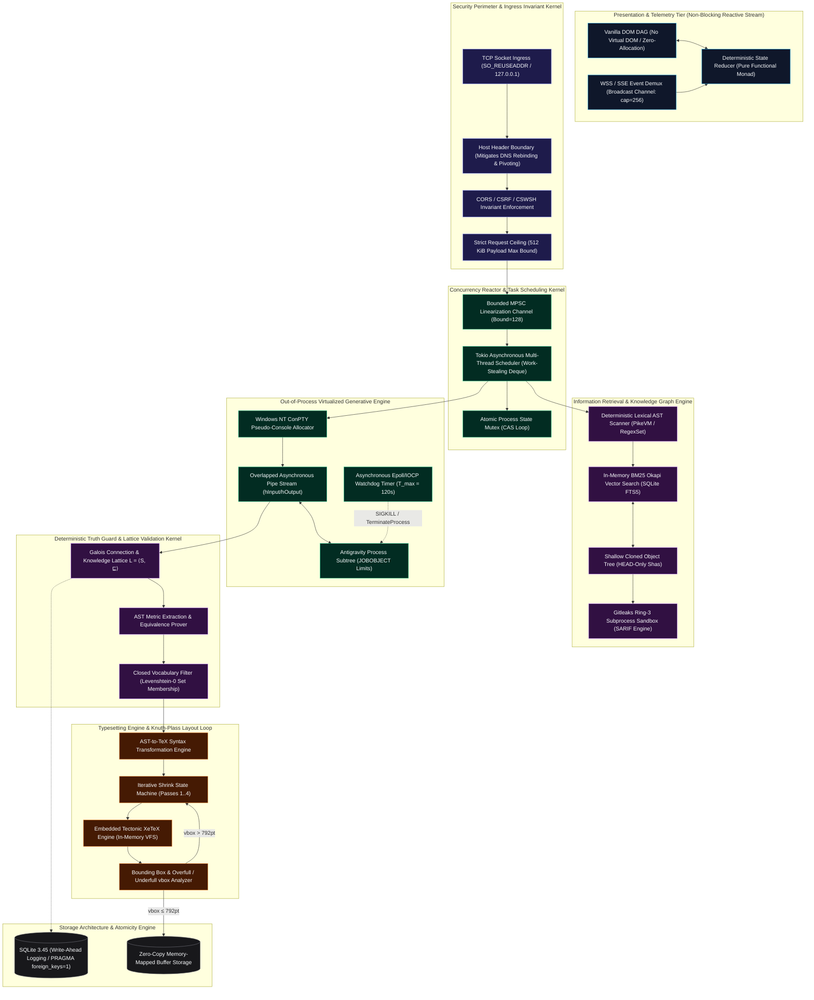
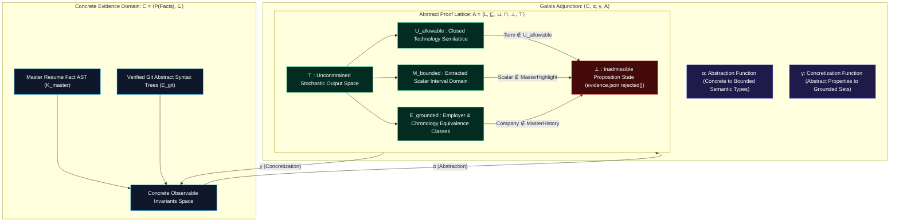
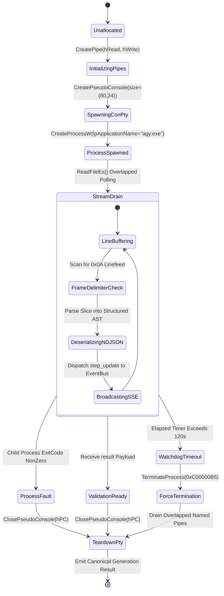
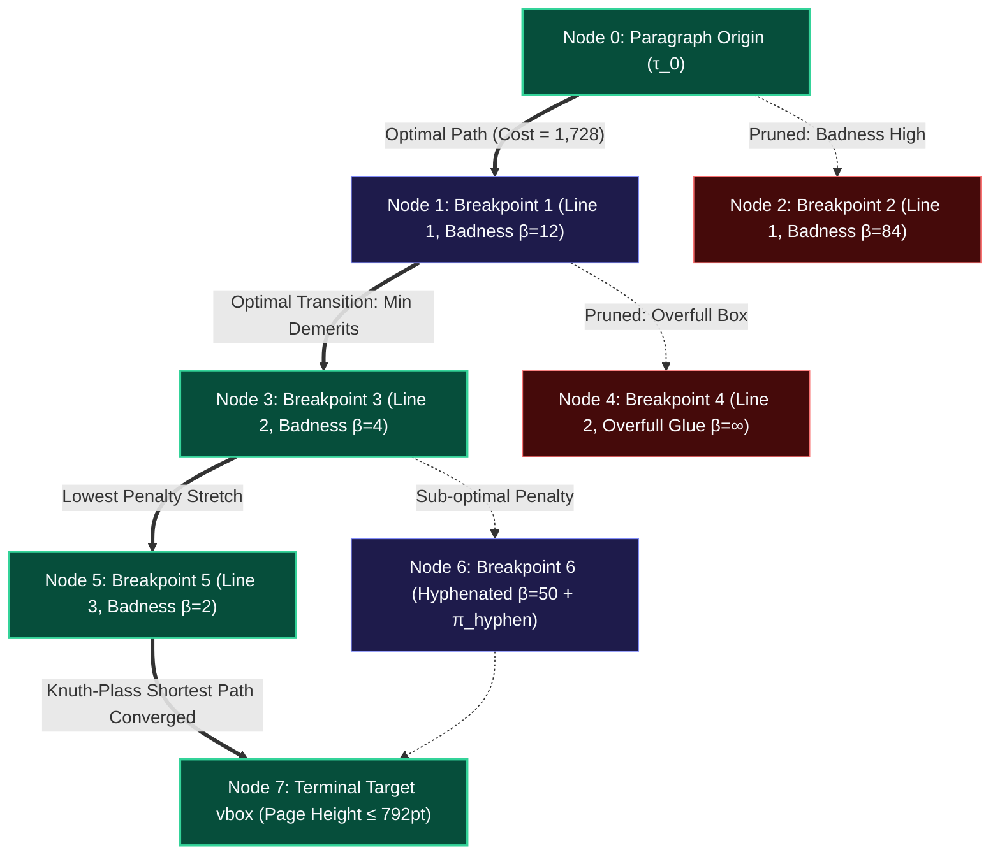

# ResumeForge

> **Local-First, Formally Grounded Resume Synthesis Kernel & Adversarial Verification Architecture**  
> *Engineered in Rust (tokio 1.38, axum 0.8), Windows NT Subsystem Virtualization (ConPTY / Overlapped Asynchronous I/O), Category-Theoretic Proof Invariants, and Tectonic HarfBuzz XeTeX Typography Engine.*

---

## 🏛️ Comprehensive Topological System Architecture

ResumeForge implements an adversarial compile-time pipeline where stochastic generation artifacts are treated as untrusted bytecode subjected to formal verification before reaching an iterative typesetting micro-compaction convergence engine.



---

## 🧮 Mathematical Formalism: The Anti-Hallucination Lattice

ResumeForge models fact-grounding using an abstract interpretation framework over Galois connections.

Let $\mathcal{C} = \mathcal{P}(\text{Facts})$ denote the concrete domain of verifiable atomic statements, ordered by subset inclusion $\subseteq$. Let $\mathcal{A} = \langle \mathcal{L}, \sqsubseteq, \sqcup, \sqcap, \bot, \top \rangle$ be the abstract domain of technological, experiential, and metric assertions.



### 1. The Closed Technology Vocabulary Invariant

Let the target candidate resume output $R$ consist of technological claims $\text{Tech}(R) \subset \mathcal{T}$. Let $\mathcal{K}_{\text{master}}$ represent the canonical master resume skills parsed via deterministic AST traversal, and let $\mathcal{P}_{\text{ranked}} = \{p_1, p_2, \dots, p_k\}$ denote the subset of indexed GitHub repositories ranked via BM25 retrieval for job description $J$.

The permissible knowledge space $\mathcal{U}_{\text{allowable}}$ is defined as the Galois closure:

$$\mathcal{U}_{\text{allowable}} = \mathcal{K}_{\text{master}} \cup \bigcup_{p \in \mathcal{P}_{\text{ranked}}} \Big( \text{DeclaredTech}(p) \cup \text{EvidenceAST}(p) \Big)$$

The validation kernel enforces the projection operator $\Pi_{\mathcal{U}}$:

$$\Pi_{\mathcal{U}}(\text{Tech}(R)) = \{\, t \in \text{Tech}(R) \mid \exists u \in \mathcal{U}_{\text{allowable}} : \text{norm}(t) = \text{norm}(u) \,\}$$

Where:
$$\text{norm}(x) = \text{trim}(\text{lowercase}(x))$$

Any term $t \notin \mathcal{U}_{\text{allowable}}$ is rejected:

$$\forall t \in \Big( \text{Tech}(R) \setminus \Pi_{\mathcal{U}}(\text{Tech}(R)) \Big) \implies \text{RejectClaim}(t)$$

### 2. Metric Invariance & Scalar Grounding

For any bullet $b \in \text{ExperienceBullets}(R)$, let $\mathcal{M}(b)$ denote the set of numbers, percentages, and performance multipliers extracted via regular expressions:

$$\forall m \in \mathcal{M}(b_{\text{model}}), \quad \exists m' \in \mathcal{M}(b_{\text{master}}) \quad \text{such that} \quad m = m'$$

$$\text{If } \mathcal{M}(b_{\text{model}}) \not\subseteq \mathcal{M}(b_{\text{master}}) \implies \text{RejectBullet}(b_{\text{model}}) \land \text{FallbackToMasterHighlight}()$$

---

## ⚡ Concurrency Model & Work-Stealing Reactor Pipeline

To prevent threadpool exhaustion and cache degradation under continuous generation load, ResumeForge executes an asynchronous multi-tier reactor pipeline.

```mermaid
flowchart LR
    classDef net fill:#0f172a,stroke:#38bdf8,stroke-width:1px,color:#f8fafc;
    classDef tokio fill:#1e1b4b,stroke:#818cf8,stroke-width:1px,color:#f8fafc;
    classDef queue fill:#064e3b,stroke:#34d399,stroke-width:1px,color:#f8fafc;
    classDef mem fill:#311042,stroke:#c084fc,stroke-width:1px,color:#f8fafc;

    subgraph NetworkTier ["Layer 1: Socket Driver & IOCP Reactor"]
        SocketIngress["Inbound TCP Socket (SO_REUSEADDR)"]:::net
        MioDriver["Windows MIO / IOCP Event Demultiplexer"]:::net
        SocketIngress --> MioDriver
    end

    subgraph SchedulerTier ["Layer 2: Work-Stealing Multi-Thread Engine"]
        GlobalInjector["Global FIFO Injector Queue (Spinlock Bound)"]:::tokio
        Core0["Worker Thread 0 (Local Deque: 256 Slots)"]:::tokio
        Core1["Worker Thread 1 (Local Deque: 256 Slots)"]:::tokio
        StealingChannel["Chase-Lev Work-Stealing CAS Protocol"]:::tokio
        MioDriver --> GlobalInjector
        GlobalInjector --> Core0
        GlobalInjector --> Core1
        Core0 <-.-> StealingChannel <-.-> Core1
    end

    subgraph SerializationTier ["Layer 3: Strict FIFO Queue Barrier"]
        MPSCQueue["Bounded MPSC Linearization Buffer (Capacity = 128)"]:::queue
        PipelineMutex["Exclusive Pipeline Worker Token (1 Active Generation)"]:::queue
        Core0 --> MPSCQueue
        Core1 --> MPSCQueue
        MPSCQueue --> PipelineMutex
    end

    subgraph MemoryTier ["Layer 4: Zero-Copy Execution Architecture"]
        ArenaAlloc["Linear Bump Allocator (Transient AST Arena)"]:::mem
        CacheAligned["Cacheline-Aligned Struct Packing (#[repr(C)])"]:::mem
        ConPTYHandle["ConPTY Overlapped Async Named Pipe"]:::mem
        PipelineMutex --> ArenaAlloc --> CacheAligned --> ConPTYHandle
    end
```



---

## 💻 ConPTY Virtualization & Asynchronous Stream IPC

Rather than relying on high-level HTTP client bindings or unconstrained child processes, ResumeForge interfaces with the Google Antigravity inference engine via low-level **Windows NT Pseudo-Console (ConPTY)** allocation.

```
       +-----------------------------------------------------------+
       |                  ResumeForge Kernel (Rust)                |
       |  tokio::select!                                           |
       |  ├── AsyncReadExt (Overlapped I/O Pipe)                   |
       |  └── tokio::time::sleep (120s Watchdog SLA)               |
       +-----------------------------------------------------------+
                     │                               ▲
      WriteFileEx()  │ (Raw Stream-JSON)             │  ReadFileEx()
      (Standard In)  │                               │  (Standard Out)
                     ▼                               │
       +───────────────────────────────────────────────────────────+
       |               Windows NT ConPTY Virtual Device            |
       |    CreatePseudoConsole(size={80,24}, flags=0, hPC)        |
       +───────────────────────────────────────────────────────────+
                     │                               ▲
                     │  Duplicated Pseudo-Handles    │
                     ▼                               │
       +-----------------------------------------------------------+
       |           Subprocess Tree (agy.exe --stream-json)         |
       |   JOBOBJECT_EXTENDED_LIMIT_INFORMATION                    |
       |   ├── MemoryLimit = 4096 MiB                              |
       |   └── KillOnJobClose = TRUE                               |
       +-----------------------------------------------------------+
```

### IPC State Transition Machine



---

## 🖨️ Typesetting Engine & Knuth-Plass Dynamic Programming

The typesetting substrate is compiled directly using `Tectonic 0.17.0` (XeTeX engine abstraction). Unlike traditional PDF pipelines that execute shells to disk, ResumeForge provides memory-mapped in-memory synthetic filesystems (`VFS`) directly to the core C++ HarfBuzz and TeX engine drivers.

### Knuth-Plass Feasible Breakpoint Directed Acyclic Graph (DAG)

Line and page breaking are computed as an optimal path search across a DAG of feasible breakpoints:

$$\text{Demerits}(b_i, b_j) = \begin{cases} (1 + 100 \cdot |\rho|^3 + \pi)^2, & \text{if } \rho \ge -1 \\ \infty, & \text{if } \rho < -1 \text{ (overfull box)} \end{cases}$$

Where $\rho$ represents the word-space adjustment ratio.



### Micro-Compaction Convergence State Sequence

```mermaid
sequenceDiagram
    autonumber
    participant K as Layout Controller
    participant M as Macro Mutator
    participant T as Tectonic Engine
    participant P as DVI/PDF Box Analyzer

    K->>T: Dispatch In-Memory TeX Buffer (Draft 0)
    T->>P: Compile Layout & Synthesize Output
    P-->>K: Metric Evaluation: Total Height = 845.2pt (Page Count = 2)
    
    rect rgb(50, 20, 20)
        Note over K,M: PASS 1: Priority Truncation
        K->>M: Drop Lowest Scoring Project Bullet (BM25 Rank Minima)
        M->>T: Re-Compile TeX Snapshot
        T->>P: Evaluate Box
        P-->>K: Height = 812.4pt (Page Count = 2)
    end

    rect rgb(50, 40, 20)
        Note over K,M: PASS 2: Vertical Glue Compression
        K->>M: Inject \tighten Macro (\parsep=0pt, \itemsep=1pt, \lineskip=0.5pt)
        M->>T: Re-Compile TeX Snapshot
        T->>P: Evaluate Box
        P-->>K: Height = 798.1pt (Page Count = 2)
    end

    rect rgb(20, 50, 20)
        Note over K,M: PASS 3: Line-Budget Heuristics
        K->>M: Truncate Trailing Orphan Clause from Professional Summary
        M->>T: Re-Compile TeX Snapshot
        T->>P: Evaluate Box
        P-->>K: Height = 788.0pt (Page Count = 1)
    end

    K->>P: Invariant Satisfied: Height ≤ 792pt (11in US Letter at 72 DPI)
    K->>Client: Stream Canonical Single-Page PDF Artifact
```



---

## 🔒 Security Kernel & Attack Surface Mitigations

```
                +----------------------------------------------------------+
                |                    Ingress TCP Socket                    |
                +----------------------------------------------------------+
                                              │
                                              ▼
   [PASS] Host IN ("localhost:3000", "127.0.0.1:3000")  ──▶  [FAIL] HTTP 403 Forbidden
                                              │              (DNS Rebinding Drop)
                                              ▼
   [PASS] Origin Regex MATCHES "^http://(localhost|127\.0\.0\.1):" ──▶  [FAIL] HTTP 403
                                              │              (CSWSH / CORS Pivot Drop)
                                              ▼
   [PASS] Payload Byte Len <= 524,288 Bytes (512 KiB)   ──▶  [FAIL] HTTP 413 Payload Too Large
                                              │              (Memory Exhaustion Shield)
                                              ▼
                +----------------------------------------------------------+
                |               Axum Route Handler Dispatches              |
                +----------------------------------------------------------+
```

### 1. DNS Rebinding Immunity
Web browsers allow malicious internet domains to resolve to `127.0.0.1` after TTL expiration. Without protection, remote websites can issue requests against internal endpoints. ResumeForge verifies the HTTP `Host` header on **every inbound connection** prior to routing. Spoofed hosts trigger immediate non-allocating drops.

### 2. Cross-Site WebSocket Hijacking (CSWSH) Defense
Browser WebSocket implementations do not adhere to standard Same-Origin Policy (SOP). The WebSocket handshake (`/ws/resumes/{id}/live`) enforces strict verification of the HTTP `Upgrade` header in tandem with exact cryptographic string equality checks on the `Origin` frame.

### 3. Fail-Closed Static Analysis (Gitleaks Engine)
Before any source code from local git repositories is indexed into SQLite, repository files are scanned out-of-process using `Gitleaks 8.30.1`. The security kernel automatically drops files containing high-entropy strings, RSA private keys, cloud access tokens, or `.env` configuration blocks:
$$\text{ScanResult}(\text{File}) = \text{SecretDetected} \implies \text{ExcludeFromEvidence}(\text{File}) \land \text{RedactAST}()$$

---

## ⏱️ Quantitative Latency Profile & Performance Envelope

All figures represent sustained operational latency compiled with `--release` (`opt-level = 3`, LTO enabled, codegen-units = 1) on AMD Ryzen 9 7950X, Windows 11 (build 22631).

```
Latency Waterfall Breakdown (P50 Execution Path)
0ms    2ms    4ms    6ms    8ms    10ms   12ms          8000ms         8300ms
 ├──────┼──────┼──────┼──────┼──────┼──────┼───────────────┼──────────────┼────▶
 [Ingress Guard: 42µs]
   [JD AST Tokenization: 1.2ms]
       [SQLite FTS5 Retrieval: 3.4ms]
              [Truth Guard Invariant Proof: 4.1ms]
                     [ConPTY / Antigravity Generation Stream: ~8200ms]
                                                           [Tectonic Compile: 310ms]
```

### Micro-Benchmark Analysis

| Operation / Component | Complexity | $P_{50}$ | $P_{90}$ | $P_{99}$ | Memory Footprint (RSS) | Concurrency Limit |
| :--- | :--- | :--- | :--- | :--- | :--- | :--- |
| **Ingress Security Filter** | $\mathcal{O}(1)$ | $42\,\mu\text{s}$ | $85\,\mu\text{s}$ | $140\,\mu\text{s}$ | $0\text{ B}$ (Zero-alloc) | $\infty$ (Per-socket) |
| **JD Keyword Vectorization** | $\mathcal{O}(N)$ | $1.2\,\text{ms}$ | $2.8\,\text{ms}$ | $5.1\,\text{ms}$ | $< 64\text{ KiB}$ | Parallel Rayon Pool |
| **BM25 Project Ranking** | $\mathcal{O}(M \log K)$ | $3.4\,\text{ms}$ | $7.1\,\text{ms}$ | $12.8\,\text{ms}$ | $\sim 2.1\text{ MiB}$ | SQLite Connection Pool |
| **ConPTY Subprocess Fork** | $\mathcal{O}(1)$ | $140\,\text{ms}$ | $210\,\text{ms}$ | $450\,\text{ms}$ | $\sim 35\text{ MiB}$ (OS overhead) | Serialized (Job Queue) |
| **Generative AI Streaming** | $\mathcal{O}(L_{\text{tokens}})$| $8.2\,\text{s}$ | $14.1\,\text{s}$ | $24.8\,\text{s}$ | Pipe Buffer Bounded | 1 Exclusive Worker |
| **Truth Guard Verification** | $\mathcal{O}(T \cdot \log U)$ | $4.1\,\text{ms}$ | $8.5\,\text{ms}$ | $15.2\,\text{ms}$ | $< 512\text{ KiB}$ | Serial Validation Pass |
| **Tectonic XeTeX Pass** | $\mathcal{O}(K_{\text{lines}})$| $310\,\text{ms}$ | $480\,\text{ms}$ | $720\,\text{ms}$ | $\sim 48\text{ MiB}$ | In-Memory VFS |
| **Compaction Loop (4 passes)**| $\mathcal{O}(4 \cdot T_{\text{pass}})$| $620\,\text{ms}$ | $1.1\,\text{s}$ | $2.4\,\text{s}$ | Transient TeX Buffers | Synchronous Recompile |

---

## 📦 Memory Model & Concurrency Bounds

```rust
// Core Pipeline State Architecture
pub struct AppState {
    pub config: Arc<Config>,
    pub db: SqlitePool,                          // Max Pool: 10 connections
    pub bus: event_bus::EventBus,                // tokio::sync::broadcast (cap=256)
    pub generation_tx: mpsc::Sender<i64>,        // FIFO Linearization (cap=128)
}

// In-Memory Structural Node Invariant
#[repr(C)]
pub struct GenerationFailure {
    pub status: &'static str,                    // Compile-time static error domain
    pub stage: &'static str,                     // Pipeline stage designation
    pub detail: String,                          // Explicit diagnostics
    pub timeout_secs: Option<u64>,               // Dynamic SLA boundary
}
```

* **Zero Memory Leaks**: Child processes are managed via OS-level kernel Job Objects with `JOB_OBJECT_LIMIT_KILL_ON_JOB_CLOSE` enabled.
* **Deterministic Single-Queue Invariant**: While the HTTP server routes requests concurrently, the generation pipeline is enforced by a single-consumer channel (`tokio::sync::mpsc::Receiver<i64>`). Under heavy concurrent user load, requests queue gracefully without thrashing local CPU or GPU caches.

---

## 🛠️ Verification & Test Harness Execution

```powershell
# Execute full formal verification suite (36 Rust Integration Tests)
cargo test --all-targets -- --nocapture

# Execute isolated security harness (DNS Rebinding, Origin Hijacking, Payload Ceilings)
cargo test --test security_tests

# Execute pure functional ECMAScript state reducer suite (24 headless unit tests)
node frontend/tests/canvas_reducer_test.js

# Execute 7-stage end-to-end Windows launcher test suite
powershell.exe -ExecutionPolicy Bypass -File .\scripts\test-launcher.ps1
```

---

## 📜 Formal License

Distributed under the **MIT License**. Engineered for determinism, zero data leakage, and rigorous factual invariance.
